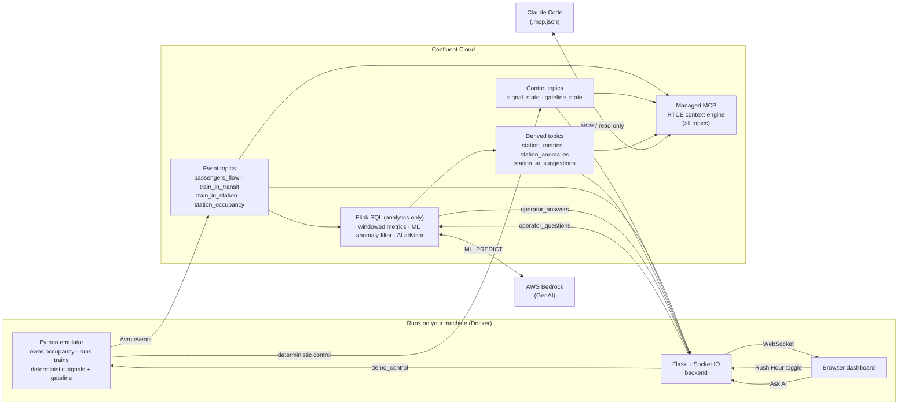
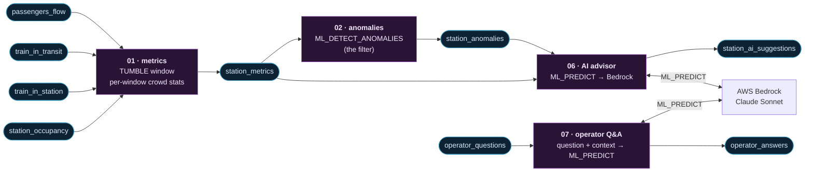

# Tilley Station: Real-Time Crowd Management on Confluent Cloud

A live, continuously-running demo of **event-driven architecture** built on
Confluent Cloud. It models crowd safety at a fictional London Underground
station, **Tilley**, on one line between two neighbours: **Overton** (west) and
**Jones** (east).

Passengers pour into Tilley from the street and from arriving trains. The
station runs its own **deterministic operational controls**, block signalling
(a train holds the platform, the next one queues at a red) and an occupancy-based
street gateline. On top of that operational event stream, **Confluent Cloud
provides the intelligence**: real-time crowd metrics, ML anomaly detection, and a
**GenAI advisor** that turns anomalies into plain-English guidance for the duty
supervisor, all within seconds, end to end.

That separation is the point: control that *should* be deterministic stays
deterministic; the streaming platform adds observability, ML, and AI-assisted
decision support. The tube theme is just the vehicle. What it demonstrates:

- **Apache Kafka** as the backbone every event flows through.
- **Apache Flink (SQL)** for real-time windowed metrics and stream processing.
- **Flink built-in ML** (`ML_DETECT_ANOMALIES`) spotting abnormal crowd spikes —
  the filter that decides which events are worth escalating.
- **Flink AI inference** (`ML_PREDICT` on **AWS Bedrock**, Claude Sonnet) turning
  those anomalies into plain-English operational advice for the ops/safety team.
- **Deterministic operational control in the emulator** (block signalling +
  gateline), a clean separation from the analytics/AI, published to Kafka so it
  is part of the same event-driven stream.
- **Ask-AI**, the supervisor can type an ad-hoc question; the backend snapshots
  the live metrics + anomalies into it, it goes onto Kafka, Flink asks Bedrock
  with that context, and the answer streams back to the browser.
- **Real-Time Context Engine (RTCE) + managed MCP**, every topic is exposed to
  Confluent Cloud's managed MCP server, so **Claude Code** can connect and ask
  questions about the live station data (read-only).

## Architecture



**The flow:** the emulator is the single source of truth for occupancy
(guaranteed never negative) and for the operational controls, it runs block
signalling and the gateline **deterministically**, and publishes everything
(raw events + `signal_state` + `gateline_state`) to Kafka. Flink is **analytics
only**: it aggregates the stream into windowed metrics, uses `ML_DETECT_ANOMALIES`
to filter for genuinely abnormal crowd events, and calls Bedrock (`ML_PREDICT`)
to turn those into advice for staff, it does **not** control the station. The
browser sees everything live over WebSockets, and the presenter can trigger a
crowd surge on demand (`demo_control`).

## The Flink pipeline, where the power is

This is the heart of the demo: a chain of Flink SQL jobs, each reading Kafka
topics and writing Kafka topics, exactly what Confluent Cloud's
[Stream Lineage](https://docs.confluent.io/cloud/current/stream-governance/stream-lineage.html)
shows you live. Rounded boxes are **Kafka topics**; rectangles are **Flink SQL
jobs** (`terraform/sql/`):



Read left to right, it tells the whole Flink story:

1. **Stream processing**, `01` fans four raw event streams into one and runs a
   single tumbling-window aggregation (`TUMBLE`) into `station_metrics`: crowd
   counts per window (~10s), continuously.
2. **Built-in ML**, `02` runs `ML_DETECT_ANOMALIES` over that windowed stream
   (the single place the anomaly ML runs). Only genuinely abnormal crowd spikes
   flow into `station_anomalies`, which feeds **both** the dashboard (the red
   markers on the occupancy chart) **and** the AI advisor.
3. **GenAI advisor**, `06` calls `ML_PREDICT` against a Bedrock model (`05`
   registers it, with a ~20-action London-Underground toolkit) to write
   `station_ai_suggestions`, concrete guidance for the ops team. It fires from
   two sources: **any anomaly** on `station_anomalies`, **and** occupancy
   *stepping up* a band on `station_metrics`, BUSY (70%, an early warning), HIGH
   (85%), or CRITICAL (95%). It never fires per raw event, so the expensive AI
   stays cheap, and the advice scales from early warning to crisis.
4. **GenAI on demand**, `07` powers the **Ask-AI** feature: a supervisor
   question lands on `operator_questions` with a live-context snapshot the backend
   took from its metrics/anomaly consumers; `07` sends it to a second Bedrock
   model (`05b`) via `ML_PREDICT` and writes the answer to `operator_answers`.

Signals and the gateline are **not** here: they are deterministic and owned by
the emulator. Flink does what Flink is uniquely good at, windowed aggregation,
streaming ML, and AI inference, on the operational event stream.

## What you need

- A **Confluent Cloud** account and a **Cloud API key** (resource-management
  scope): `confluent api-key create --resource cloud`.
- **Terraform** ≥ 1.5 and the **Confluent CLI**, to provision the cloud side.
- **Docker** (Desktop or Engine), to run the app layer. *No Python needed.*
- An **AWS account with Bedrock access** and an IAM access key/secret, the
  GenAI advisor is part of the pipeline. Enable the model's **inference profile**
  under **Bedrock → Model access** (default: Claude Sonnet 4.5). The model id is
  combined with the region-geo prefix into a cross-region inference profile
  (`us-east-1` → `us.anthropic.claude-sonnet-4-5-…`), which is how newer Claude
  models must be invoked, the bare model id returns 404.

Everything (Confluent Cloud and Bedrock) runs in **AWS `us-east-1`** by default,
so the Flink AI inference calls Bedrock in-region. Change `cc_cloud_region` /
`bedrock_region` together to relocate it.

## Quickstart

### 1. Clone and configure

```bash
git clone <this-repo> tube-station && cd tube-station
cp .env_example .env
```

Edit `.env` and fill in your **Confluent Cloud** API key/secret and your **AWS**
keys (for the Bedrock advisor). Keep it as plain `KEY=VALUE` lines. Terraform
fills in the Kafka / Schema Registry values for you in the next step.

### 2. Provision Confluent Cloud

```bash
set -a; source .env; set +a          # load Confluent + AWS creds into your shell
cd terraform
terraform init
terraform apply
```

This creates the environment, a Standard Kafka cluster, Schema Registry, all
topics + Avro schemas, the Flink compute pool, every Flink SQL statement, the
Bedrock connection + two models (the alert advisor and the Ask-AI model), and it
enables **RTCE on every topic** plus a read-only **`mcp-reader`** principal (and
its Cloud API key) for the managed MCP server. It also writes the Kafka / Schema
Registry connection details, the domain constants, **and** the managed-MCP URL +
token (`CC_MCP_URL` / `CC_MCP_AUTH`) back into your root `.env` automatically.

### 3. Run the demo (Docker)

```bash
cd ..
docker compose up --build
```

This starts the **emulator** (generates traffic) and the **backend** (serves the
dashboard). Open **http://localhost:8080**.

The dashboard shows the **AI supervisor advice** feed at the top, an animated
station strip (trains approaching, queueing behind a red signal, dwelling at the
platform and departing; the Tilley box fills with the crowd and shows live
occupancy; signals and the street gateline change colour), an occupancy chart
with anomaly markers, a flow-in/out chart, and a live event feed.

Flip the **Rush Hour** toggle (top-right, red when on) to trigger a surge and
watch the system react, as occupancy climbs the gateline **restricts** then
**closes** to cap street inflow, `ML_DETECT_ANOMALIES` flags the spike, and the
**AI advisor** posts concrete guidance for the ops/safety team (early warning at
BUSY, escalating through HIGH and CRITICAL). Trains keep cycling through the
platform (block signalling), draining the crowd, until the gateline reopens. Flip
it back to reset.

Switch to the **Ask AI** tab (top of the page) to ask ad-hoc questions: it keeps
the full question/answer history with timestamps and a text box at the bottom.
Each question is enriched with the live station context and answered by Bedrock,
while the **Dashboard** tab keeps running in the background.

Stop with `Ctrl-C`, or `docker compose down`. (Re-run with `--build` whenever you
change the frontend, since it's baked into the image.)

### Preview the UI without the cloud

The dashboard has a self-contained demo mode that synthesises the whole story in
the browser, handy for a quick look with no pipeline running:

**http://localhost:8080/?demo=1**

### 4. Tear down

```bash
docker compose down
cd terraform && terraform destroy
```

Confluent CFUs and the cluster cost money, always destroy after you're done.

## Ask the live data from Claude Code (RTCE + managed MCP)

`terraform apply` also enables Confluent's **Real-Time Context Engine (RTCE)** on
**every topic** in this demo (`confluent_rtce_topic`, one per topic), so the data
is queryable through Confluent Cloud's **managed MCP server** — and Claude Code
can connect to it and ask questions about the live station data.

The repo-root **`.mcp.json`** declares the server (`cc-managed-mcp`, an HTTP MCP)
and resolves from two env vars:

```jsonc
"cc-managed-mcp": {
  "type": "http",
  "url": "${CC_MCP_URL}",                         // regional, cluster-scoped endpoint
  "headers": { "Authorization": "Basic ${CC_MCP_AUTH}" }
}
```

- **`CC_MCP_URL`** — Terraform builds it and writes it into `.env`
  (`https://mcp.<region>.<cloud>.confluent.cloud/mcp/v1/context-engine/organizations/<org>/environments/<env>/kafka-clusters/<lkc>`).
- **`CC_MCP_AUTH`** — Terraform mints a **Global** Cloud API key owned by the
  read-only **`mcp-reader`** service account, base64-encodes `key:secret`, and
  writes it into `.env`. (It's a secret; the real `.env` is git-ignored.)

Then launch Claude Code from the repo root — both values come from `.env`:

```bash
set -a; source .env; set +a          # exports CC_MCP_URL + CC_MCP_AUTH
claude
```

Approve `cc-managed-mcp` on first run, then ask, e.g.:
> *"Using cc-managed-mcp, list the topics and summarise the latest station_metrics and station_anomalies."*

## Running without the emulator (optional)

`tools/mockfeed.py` publishes synthetic Avro to every topic (a scripted surge
plus rough stand-ins for the metrics/anomaly/AI outputs), so you can drive the
dashboard without the emulator + Flink:

```bash
docker compose --profile mock up --build    # backend + mock feed
```

## Configuration

There is no separate config data file, everything is either an **env var** or a
**Terraform variable**:

| Where | Holds |
|---|---|
| **`.env`** (git-ignored; template in **`.env_example`**) | Everything the Python apps read: secrets (Confluent/AWS keys), the domain constants (`STATION_CAPACITY`, `AGG_WINDOW_SECONDS`, `PCT_LOW/HIGH/CRITICAL`, `STATION_NAME`), the demo knobs (foot/train/surge rates, `INITIAL_OCCUPANCY_FRACTION`), and the managed-MCP `CC_MCP_URL` + `CC_MCP_AUTH` (both written by `terraform apply`). Plain `KEY=VALUE` lines. |
| **`terraform/vars.tf`** | Terraform's copy: cloud infra (region, cluster, CFUs, retention, Bedrock model) **and** the domain constants used to template the Flink SQL. |

The domain constants exist in both places by design, kept in step automatically:
`terraform apply` resolves them from `vars.tf` and **writes them into `.env`**
(along with the Kafka / Schema Registry connection details) via
`terraform/write_env.sh`, so Flink and the Python apps always use the same
numbers. **Nothing is hard-coded in the Python source**, the apps read every
value from the environment and **fail loudly** if `.env` is missing a key (no
silent defaults). `cp .env_example .env` gives you a complete starting point; the
test suite loads `.env_example` itself so it needs no real `.env`.

> **Security note:** the Bedrock connection's AWS keys are stored in Terraform
> state. `terraform.tfstate` is git-ignored, keep it secure, or use an encrypted
> remote backend.

## How the pieces fit

```
tube-station/
├── .env_example           # template for .env, every runtime var lives here
├── .mcp.json              # Claude Code MCP config (managed MCP / RTCE endpoint)
├── Dockerfile             # one image: emulator, backend, or mock feed
├── docker-compose.yml     # runs the app layer
├── terraform/             # Confluent Cloud footprint + Flink SQL (terraform/sql/)
├── emulator/              # Python passenger/train simulator (owns occupancy + controls)
├── backend/               # Flask + Socket.IO: streams topics to the browser
├── frontend/              # browser dashboard (served by the backend)
└── tools/mockfeed.py      # synthetic data generator (run the UI without the cloud pipeline)
```

- **Emulator**, generates foot traffic and a per-train lifecycle (approach →
  dwell → depart), owns occupancy, and runs the two **deterministic** operational
  controls itself: **block signalling** (one train per platform per direction;
  the signal is RED while a train dwells and following trains queue behind it) and
  the **gateline** (throttles street inflow by occupancy band). It publishes
  `signal_state` and `gateline_state` to Kafka. Self-stabilising boarding keeps
  occupancy in a healthy mid-band; only a surge pushes it critical, and it
  recovers. The only control it consumes is the presenter's `demo_control`.
- **Flink SQL** (`terraform/sql/`), **analytics only**: windowed crowd metrics
  (`01`), `ML_DETECT_ANOMALIES` as the filter (`02`), the Bedrock-backed advisory
  AI (`05`/`06`, `ML_PREDICT`) triggered by anomalies + occupancy bands, and the
  on-demand **Ask-AI** job (`05b`/`07`) that answers a supervisor question, with
  a live-context snapshot the backend attaches, via a second Bedrock model. It
  derives insight from the stream; it does not control the station.
- **Backend**, one Socket.IO channel per stream (`occupancy`, `metrics`,
  `anomaly`, `signal`, `gateline`, `ai_suggestion`, `operator_answer`, plus raw
  events); the `POST /demo/surge` / `POST /demo/reset` control endpoints; and
  `POST /ask`, which publishes the question to `operator_questions`.
- **Frontend**, a single React page served at `/` (loaded from CDNs, no build
  step or `npm`) with two tabs: a **Dashboard** (AI advice feed, animated SVG
  station strip with the occupancy readout in the Tilley box and trains that queue
  behind red signals, Chart.js occupancy/flow charts, live event feed, Rush Hour
  toggle) and an **Ask AI** tab (full Q&A history with timestamps + a text box).
  Append `?demo=1` for a cloud-free preview.

## Developing without Docker

You can run the apps natively with Python 3.12:

```bash
python3.12 -m venv .venv && source .venv/bin/activate
pip install -r emulator/requirements.txt -r backend/requirements.txt
python -m emulator.run     # terminal 1
python -m backend.run      # terminal 2 → http://localhost:8080
```

Run the test suite (no cloud needed, it uses in-memory producers and a fast
virtual-clock simulator):

```bash
python -m pytest
```
