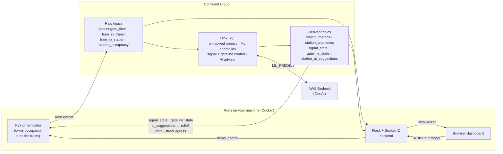

# Tilley Station — Real-Time Crowd Management on Confluent Cloud

A live, continuously-running demo of **event-driven architecture** built on
Confluent Cloud. It models crowd safety at a fictional London Underground
station, **Tilley**, on one line between two neighbours — **Overton** (west) and
**Jones** (east).

Passengers pour into Tilley from the street and from arriving trains. Confluent
watches the crowd in real time and, on its own, **holds trains at red signals**
and **throttles the street gateline** before the station overflows — then
**releases the trains** so waiting passengers can board and leave. A **GenAI
advisor** tells the duty supervisor exactly what to do, all within seconds, end
to end.

The tube theme is just the vehicle. What it actually demonstrates:

- **Apache Kafka** as the backbone every event flows through.
- **Apache Flink (SQL)** for real-time windowed metrics and stream processing.
- **Flink built-in ML** (`ML_DETECT_ANOMALIES`) spotting abnormal crowd spikes.
- **Flink AI inference** (`ML_PREDICT` on **AWS Bedrock**, Claude Sonnet) turning
  alerts into plain-English operational advice.
- **Two closed-loop controllers** in Flink SQL that act back on the system —
  and a deadlock-breaker that keeps the station from ever getting stuck.
- **AI as actuator** — the advisor appends machine directives the emulator parses
  and acts on: at critical occupancy it dispatches an empty **relief train** that
  bypasses the signals, and when it advises alternatives/buses it lets a batch of
  passengers **leave via the street** (occupancy is never allowed to go negative).

## Architecture



**The closed loop:** the emulator produces passenger and train events and is the
single source of truth for how many people are inside (occupancy is guaranteed
never to go negative). Flink aggregates those events, detects anomalies, and
decides the control state. The emulator consumes that control state back —
holding trains at red and throttling street inflow — which changes occupancy,
and the loop repeats. The browser sees everything live over WebSockets, and the
presenter can trigger a crowd surge on demand.

## What you need

- A **Confluent Cloud** account and a **Cloud API key** (resource-management
  scope): `confluent api-key create --resource cloud`.
- **Terraform** ≥ 1.5 and the **Confluent CLI** — to provision the cloud side.
- **Docker** (Desktop or Engine) — to run the app layer. *No Python needed.*
- An **AWS account with Bedrock access** and an IAM access key/secret — the
  GenAI advisor is part of the pipeline. Enable the model's **inference profile**
  under **Bedrock → Model access** (default: Claude Sonnet 4.5). The model id is
  combined with the region-geo prefix into a cross-region inference profile
  (`us-east-1` → `us.anthropic.claude-sonnet-4-5-…`), which is how newer Claude
  models must be invoked — the bare model id returns 404.

Everything (Confluent Cloud and Bedrock) runs in **AWS `us-east-1`** by default,
so the Flink AI inference calls Bedrock in-region. Change `cc_cloud_region` /
`bedrock_region` together to relocate it.

## Quickstart

### 1. Clone and configure

```bash
git clone <this-repo> tube-station && cd tube-station
cp .env_example .env
```

Edit `.env` and fill in your **Confluent Cloud** API key/secret and your **AWS**
keys (for the Bedrock advisor). Keep it as plain `KEY=VALUE` lines. Terraform
fills in the Kafka / Schema Registry values for you in the next step.

### 2. Provision Confluent Cloud

```bash
set -a; source .env; set +a          # load Confluent + AWS creds into your shell
cd terraform
terraform init
terraform apply
```

This creates the environment, a Standard Kafka cluster, Schema Registry, all
topics + Avro schemas, the Flink compute pool, every Flink SQL statement, and the
Bedrock connection + model + AI advisor. It also writes the Kafka and Schema
Registry connection details back into your root `.env` automatically.

### 3. Run the demo (Docker)

```bash
cd ..
docker compose up --build
```

This starts the **emulator** (generates traffic) and the **backend** (serves the
dashboard). Open **http://localhost:8080**.

The dashboard shows an occupancy gauge, a platform-safety panel (evacuation
time), an animated station strip (trains approaching, holding at signals,
dwelling and departing; the Tilley box fills with the crowd; signals and the
street gateline change colour), an occupancy chart with anomaly markers, a
flow-in/out chart, a live event feed, and the AI advisor's advice.

Flip the **Rush Hour** toggle (top-right, red when on) to trigger a surge and
watch the system react — signals hold at red, the gateline restricts then
closes, an anomaly is flagged, and the advisor speaks. As it climbs, the advisor
also advises alternatives/buses and a batch of passengers **leaves via the
street** (a negative flow in the feed). At critical occupancy the signals force
green *and* the advisor calls for the standby **relief train**, which the
emulator dispatches (an empty reserve that boards the crowd out) so occupancy
drains. Flip it back to reset.

Stop with `Ctrl-C`, or `docker compose down`. (Re-run with `--build` whenever you
change the frontend, since it's baked into the image.)

### Preview the UI without the cloud

The dashboard has a self-contained demo mode that synthesises the whole story in
the browser — handy for a quick look with no pipeline running:

**http://localhost:8080/?demo=1**

### 4. Tear down

```bash
docker compose down
cd terraform && terraform destroy
```

Confluent CFUs and the cluster cost money — always destroy after you're done.

## Running without the emulator (optional)

`tools/mockfeed.py` publishes synthetic Avro to every topic (including a scripted
surge and simplified control loops), so you can drive the dashboard without the
emulator + Flink:

```bash
docker compose --profile mock up --build    # backend + mock feed
```

## Configuration

Each setting lives in exactly one place:

| File | Holds |
|---|---|
| **`demo.config.json`** | shared domain constants — station capacity, evacuation flow, aggregation window, and the crowd thresholds. Read by both Terraform and the Python apps. |
| **`.env`** (git-ignored) | secrets (Confluent/AWS keys) and app runtime knobs (passenger/train/surge rates). Kafka + Schema Registry values are written here automatically by `terraform apply`. Plain `KEY=VALUE` lines. |
| **`terraform/vars.tf`** (+ `terraform.tfvars`) | cloud infrastructure — region, cluster, compute units, retention, Bedrock model. |

Change a threshold or the window once in `demo.config.json` and both the Flink
SQL and the Python apps pick it up.

> **Security note:** when the AI advisor is enabled, the Bedrock connection's AWS
> keys are stored in Terraform state. `terraform.tfstate` is git-ignored — keep
> it secure, or use an encrypted remote backend.

## How the pieces fit

```
tube-station/
├── demo.config.json       # single source of truth for shared domain constants
├── Dockerfile             # one image: emulator, backend, or mock feed
├── docker-compose.yml     # runs the app layer
├── terraform/             # Confluent Cloud footprint + Flink SQL (terraform/sql/)
├── emulator/              # Python passenger/train simulator (owns occupancy)
├── backend/               # Flask + Socket.IO: streams topics to the browser
├── frontend/              # browser dashboard (served by the backend)
└── tools/mockfeed.py      # synthetic data generator (run the UI without the cloud pipeline)
```

- **Emulator** — generates foot traffic and a per-train lifecycle (approach →
  dwell → depart), owns occupancy, and obeys the control state coming back from
  Flink (signals, gateline) plus the AI directives (dispatch the relief train,
  divert passengers to the street). Self-stabilising boarding keeps occupancy in a
  healthy mid-band during normal operation; only a surge pushes it critical, and
  it recovers afterwards.
- **Flink SQL** (`terraform/sql/`) — windowed crowd metrics, `ML_DETECT_ANOMALIES`
  on foot/alighting spikes, the signal and gateline control loops (emit-on-change),
  and the Bedrock-backed AI advisor (which appends machine directives —
  `DISPATCH_RELIEF_TRAIN` at critical occupancy, `DIVERT_TO_STREET` when advising
  alternatives — that the emulator parses and acts on).
- **Backend** — one Socket.IO channel per stream (`occupancy`, `metrics`,
  `anomaly`, `signal`, `gateline`, `ai_suggestion`, plus raw events) and the
  `POST /demo/surge` / `POST /demo/reset` control endpoints.
- **Frontend** — a single React page served at `/` (loaded from CDNs, no build
  step or `npm`): occupancy gauge, safety panel, animated SVG station strip,
  Chart.js occupancy/flow charts, live event + AI-advice feeds, and the Rush
  Hour toggle. Append `?demo=1` for a cloud-free preview.

## Developing without Docker

You can run the apps natively with Python 3.12:

```bash
python3.12 -m venv .venv && source .venv/bin/activate
pip install -r emulator/requirements.txt -r backend/requirements.txt
python -m emulator.run     # terminal 1
python -m backend.run      # terminal 2 → http://localhost:8080
```

Run the test suite (no cloud needed — it uses in-memory producers and a fast
virtual-clock simulator):

```bash
python -m pytest
```
